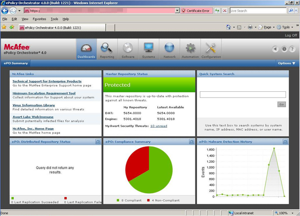

# Antivirus Deployment

## Stats

- Completed: 8th October 2011
- Duration: 8 weeks

## Categories

- Security
- Software
- Windows

## Installation of Company Standard Antivirus Client and Server Software

Despite previous attempts at delivering an antivirus solution to cover PCs which weren't part of the company's Active Directory domain, there were many computers without antivirus protection, had out of date definitions, or the software simply wasn't functioning. To correct this and follow the company standard I embarked on a project to roll out McAfee ePolicy Orchestrator (ePO) and VirusScan Enterprise (VSE).

Firstly a number of local servers were chosen to act as SuperAgents and for Rogue System Detection. With the Rogue System monitors in place a list of PCs requiring my attention was quickly created and then prioritised based upon their usage (and in turn risk of infection) and opportunity to install and test VSE. Working through the list a set of test PCs were first identified so that policies could be developed and best practices tested to ensure no conflicts occurred with existing software. ePO and VSE was then rolled out in a phased manner to all the PCs, which necessitated working outside of normal hours so that the install and testing could be performed without interruption to plant operations.

With all of the PCs now with ePO and VSE installed, monitoring and administration can be performed centrally with little effort. The Rogue System monitor also provides valuable information on systems without antivirus or unauthorised devices connected to the network so that the standard can be maintained.

## Technology
- McAfee Agent
- McAfee ePolicy Orchestrator
- McAfee VirusScan Enterprise

<!-- origin: https://web.archive.org/web/20220924214652/https://community.spiceworks.com/people/michaelvickers/projects/antivirus-deployment -->
