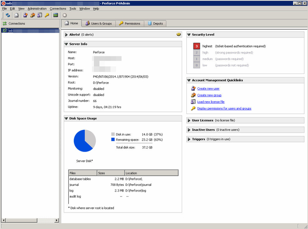

# CAD Drawing Version Control

## Stats

- Completed: 14th July 2014
- Duration: 6 weeks

## Categories

- Software
- Windows

## Implemented a Version Control and Backup System for Computer Aided Design Files

With a planned expansion of 3D computer-aided design (CAD) PCs and an ever increasing amount of design files, a system to manage file versioning and backups became a necessity. Considerable research was made into the possible solutions for version control, and although a bespoke product existed from the CAD software manufacturer, Perforce P4D was chosen for this purpose in the end. The low cost of entry, ability to handle large binary files, scalability, and customisation made P4D a strong contender, and after both the end users and I experimented with a sample install it proved to be a suitable choice.

Perforce was installed on an existing server and best practices followed for both the security and operational configuration. SSL and ticket-based authentication was implemented (so that Perforce is running in its highest possible security state), and the Perforce root directory moved to a file system separate from the application directory. As the files to be stored in P4D aren't those it's natively designed for, some additional configuration was made to ensure they are handled consistently. The typemap command was used to configure P4D so that the CAD files are correctly recognised as binary format, are locked exclusively when being modified to prevent concurrent changes as textual comparison isn't possible to resolve conflicts with a binary file, and are stored compressed on disc so that space is not used unnecessary.

To provide the backups of both the Perforce data and the versioned files, bespoke batch file scripts were created. The main script which is executed nightly follows Perforce's standard backup procedure steps, but to ensure a successful backup is made the script validates the return codes from each Perforce command executed, and computes checksums of the backup files to ensure these match with those returned by Perforce. To provide further validation of the backup and prove the backup files could actually be used to restore Perforce in the event of a disaster, a test restoration of the backup was also built into the script. The script then creates a zip archive with all the files needed to restore Perforce along with the actual versioned files, tests the archive's integrity, and finally copies it to the backup media.  Any unexpected return codes or miss-matched checksums would result in the script sending an email to the system administrators with a copy of the log file produced by the script.

Although there was an overhead in implementing and configuring Perforce for use with the CAD files, it has proven to be worthwhile. The user-friendly P4V and P4EXP tools have led to a simple workflow for the end users, and in-turn a robust version control system.

## Technology

- 7-Zip
- Batch file
- Microsoft Windows Server 2003
- Perforce
- SourceForge Blat
- SSL

<!-- origin: https://web.archive.org/web/20220929084035/https://community.spiceworks.com/people/michaelvickers/projects/cad-drawing-version-control -->
