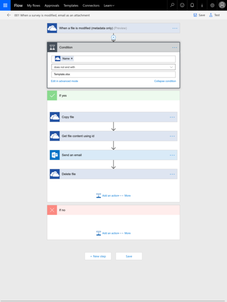
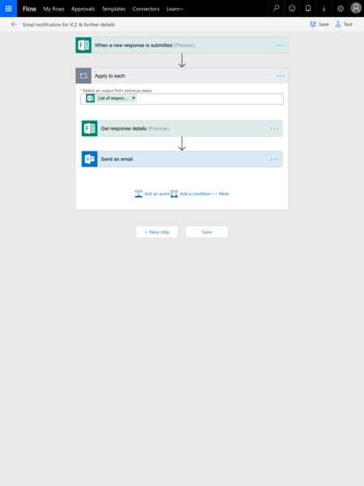

# Client Q&A Form With Push Notification

## Stats

- Completed: 25th July 2017
- Duration: 2 weeks

## Categories

- Cloud Computing & SaaS
- Email
- Programming & Development
- Software

## Recording Form Answers With a Custom Notification When a Response Is Received

With a need to ask clients a number of questions and record their answers, Excel Online with its Survey feature seemed a good fit and provided most of the features required.

The one feature that was missing was a notification when a survey was completed (at the time Microsoft Forms hadn't been launched), so we needed a solution to alert the department to a new response having emailed out the URL to the Excel Online Survey. To plug this gap Microsoft Flow was used and a custom flow developed to handle the event and perform some corresponding actions.

The custom flow was created to watch a particular OneDrive folder for any file modifications, i.e. the event when the Excel Online Survey is recorded. When this is identified an initial filtering condition is first checked to halt the flow eg in the event of a template file being changed. If the initial filter passes successfully, i.e. a notification is needed, a copy of the file is made to a temporary working directory in OneDrive and the contents of this new file is retrieved. An email is then sent to the department's shared mailbox, with the file contents retrieved in the previous step used as an email attachment. With the email sent successfully the last step of the flow is to delete the temporary working copy of the file.

The flow was implemented with the temporary working copy for two reasons, firstly so that the file could be attached to the email directly so the department has the data directly to hand when receiving the notification and don't need to seek this out in OneDrive. Secondly, to ensure the file only contains the response which triggered the flow, as potentially if the Excel Online Survey is repeatedly completed in short succession the source file may have multiple entries.

The logic in the flow took some tweaking to ensure it ran smoothly, mostly around detecting the modification event and attaching the file reliably. Some error handling was also included in the early versions to trigger alternative alert emails in the event of the temporary working copying and deletion failing or an error in attaching this to the alert email, but these error handles were later removed due to false positives occurring. In the end this solution worked nicely, client responses got recorded and an email was sent to the departmental mailbox with the response XLS file attached.

Later in the year Microsoft launched Forms, a specific tool for the purpose, so we migrated the Excel Online Survey over to this app mainly for the nicer presentation options and sharing features. Despite Forms having its own built-in alert feature, we retained Flows to provide the notification emails due to its greater customisation options with the resulting email and the ability to send the email to a mailbox other than the one that created the Form. The new flow was much simpler in implementation and took the "new response submitted" event, got the response details, and then sent the notification email with some of the response details in the body of the message.

Flows and the two form tools we used have proven a reliable solution and a quick way to capture customer details without the need for a full blown dedicated web app.

## Technology 

- Microsoft Office 365 Business

<!-- origin: 
https://web.archive.org/web/20220927135722/https://community.spiceworks.com/people/michaelvickers/projects/client-q-a-form-with-push-notification -->
