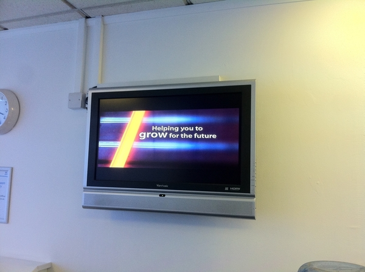
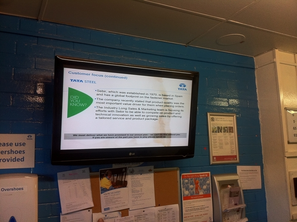

# Communication TVs

## Stats

- Completed: 25th May 2010
- Duration: 2 weeks
- Users: 500

## Categories

- Hardware
- Linux
- Software

## Creation of a System To Publicly Display Electronic Media Across the Business

Having had several large flat screen TVs installed in key areas of the business, a computer system was needed to reliably display information on the TVs. With a surplus of old PCs it made sense to reuse these to display content on the TVs, an attempt had been made at this in the past however it proved very unreliable. With the PCs being many years old they struggled to show a PowerPoint presentation continuously for more than a few days, before Windows complained about a lack of virtual memory or stopping completely. The unreliability and difficulty for the users to update the PCs with new content, spurred me on to find a more fit for purpose solution.

With the requirement of a highly available and accessible system, a web page solution was developed. The web page I created displayed a series of images in a loop using JavaScript, with a pause between each image of about 2 minutes. With the web page being hosted on an Intranet server, users could simply create slides in PowerPoint and then save them as images to the Intranet server to update the TVs, after which they would be immediately shown on the web page.

To display the web page on the actual TVs the old PCs were formatted and Puppy Linux installed upon them. Linux was chosen due to its robustness and Puppy in particular as it was lightweight and responsive even on very old hardware. Several Bash scripts were written for this purpose and automated the start up of Chrome (with appropriate command-line options for kiosk mode and no caching) to show the TV web page, disable the screen saver, and other admin tasks.

The new system has proven to be massively reliable, with the PCs having an available up time of 100%. In fact the weakest link is now the TVs, which due to being on 24/7, sometimes switch themselves off due to overheating!

## Technology

- Bash
- Dell Optiplex GX110
- Google Chrome
- HTML
- JavaScript
- Linux
- Microsoft PowerPoint
- VNC

<!-- origin: https://web.archive.org/web/20220925204933/https://community.spiceworks.com/people/michaelvickers/projects/communication-tvs -->
