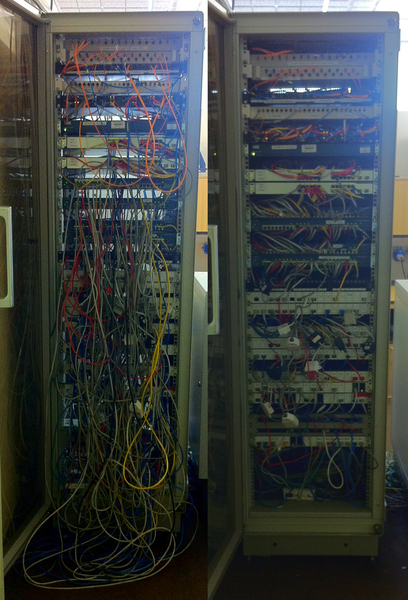
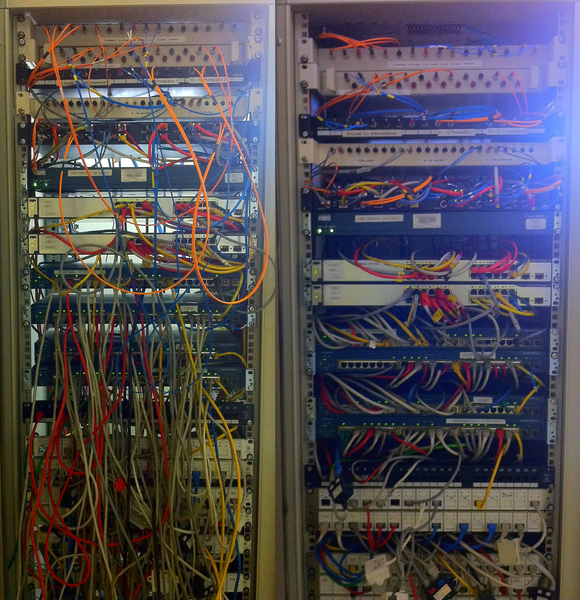
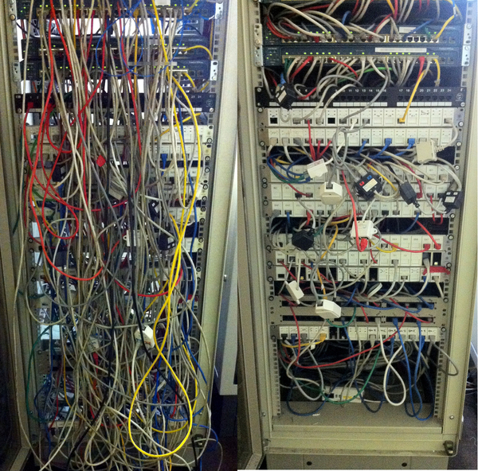

# Core Network Cabinet Standardisation

## Stats

- Completed: 27th July 2014
- Devices: 250
- Duration: 2 weeks
- Users: 250

## Categories

- Networking

## Overhauling a Business Critical Network Cabinet To Raise Its Standard

This was the big one; with the potential to disconnect the majority of users from the local area network or stopping access to any of the company servers, there was serious potential to cause massive disruption if I got this project wrong. Having tackled the majority of the substandard network cabinets previously, my attention now turned to the one which was seemingly beyond hope. The network cabinet housed patch cabling for the majority of the users, the local servers, access switches located across the site, and the uplink to the WAN. The volume of cabling, devices, patch panels, and lack of management or planning in the past only increased the risk of a small mistake turning into a massive one.

Using the business standard I'd developed for network cabinets previously meant designing the "to be" state was easy, the difficult part was in the planning to allow me to change the "as is". The network cabinets I'd tackled in the past although still sizeable were manageable and could be completed in a single stage, from start to finish inside a few hours. With this project having such a massive amount of work needed and the potential risks, I decided to split it down into bite size pieces. My initial goal was to simply organise the devices and patch panels into the right locations, and move the patch cabling to the rear of the cabinet. This work would lay the foundations for the cabinet and bring immediate benefits by making access to the devices and panels easier.

With a suitable outage period identified, to coincide with a weekend electrical power outage to avoid unnecessarily interrupting user's network access, the plan went ahead. A full audit was made of the cabinet in the days before the outage; which patch leads went where, which ports were up or down, detailed photos taken for reference, and a drawing produced of where the equipment would be relocated to. Implementing the plan went as expected and although time consuming was without problem, and with the work completed the benefits of the detailed and meticulous planning was seen. Only a single user was left disconnected after the work took place, and this was due to a faulty patch lead rather than the actual work I'd carried out.

With my initial goal achieved and arguably the most difficult part now complete, my focus will now be on cable management which will be implemented in a future outage. For the time being the ease of access to the equipment and simplified patching makes the cabinet a delight to work upon compared to what it once was.

## Technology

- Cat 5 cabling
- Cisco Catalyst WS-2950-24
- Fiber optic cabling
- Patch panels

<!-- origin: https://web.archive.org/web/20220926094221/https://community.spiceworks.com/people/michaelvickers/projects/core-network-cabinet-standardisation -->
