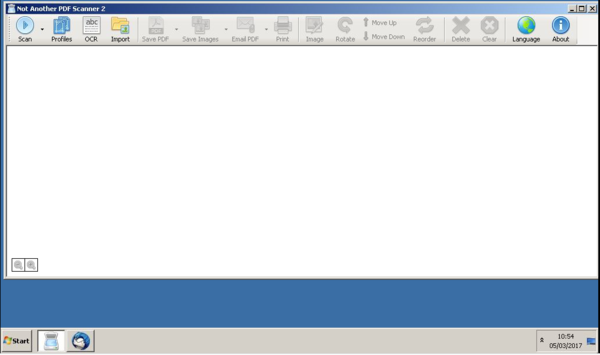

# Document Scanning Service

## Stats

- Completed: 3rd March 2016
- Duration: 3 days

## Categories

- Hardware
- Software
- Windows

## Communal Document Scanning Service With Email File Transfer

Whilst awaiting the arrival of the company's own combined print/scan/copy/fax solution, there was a pressing need to provide a communal document scanning service which could scale to the demands of the business. As the new solution would use email to transfer scanned documents to their owner, a similar service was proposed using a desktop PC, scanner with document feed, and the necessary software.

Initially a Linux based scanning solution was trialled, however the integration of scanning software and email client was awkward, and would have relied on users following a procedure rather than the software taking the burden. Plan B was to use Windows this time with NAPS2 for scanning and Thunderbird for email, who's programs integrated better and provided a nicer user experience.

With a PC rebuilt with a fresh Windows install, security software, NAPS2, and Thunderbird installed, the configuration could begin. Thunderbird was configured with the business's internal SMTP server only, a default email signature stating it was from the scanning service, auto adding of recipients to the address book to ease future usage, auto spell check, and a subject manager add-on so messages had a default subject. NAPS2 was set up with the necessary scanning profiles, which then to prevent accidental changes, were backed up into a separate file. A simple command script then restores these backed up scanning profiles before opening the NAPS2 software, so that any profile changes are removed. Windows was also configured to display a suitable screen saver, perform unattended reboots each week, and to automatically log in.

Now users have a simple to use communal scanning service; to scan they simply insert their documents into the scanner's feed, click start scanning on NAPS2, when finished choose Email PDF, enter their address into the Thunderbird message, and click Send. Job done!

## Technology

- Dell OptiPlex 320
- Mozilla Thunderbird
- VNC

<!-- origin: 
https://web.archive.org/web/20230206022106/https://community.spiceworks.com/people/michaelvickers/projects/document-scanning-service -->
