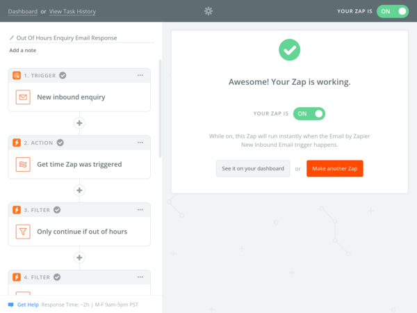

# Email Auto Reply With Processing Logic

## Stats

- Completed: 22nd March 2018 
- Duration: 1 month

## Categories

- Cloud Computing & SaaS
- Email
- Programming & Development

## Out-of-Hours Replies to Customer Enquiries With Custom Processing Logic

To help with customer engagement when an email enquiry was received it was identified that an automatic reply would be helpful. That seemed simple enough, but the tricky part was this was only to be active when the business was closed and that the incoming email could come from a variety of source providers each with a different way of presenting the customers email address. So the standard auto reply provided by an email client just wouldn't cut it, we'd need to add our own business logic and have some sort of parsing method for the email body.

After researching the options it became a choice of two options: build our own solution from scratch which was do-able but would be time consuming to create, or make use of a cloud based service similar to IFTTT which can handle the event and the required end result. Zapier offered a nice middle ground between the two allowing us to use typical programming conditions and functions, whilst still handling the heavy-lifting of handling the inputs and outputs from our logic.

To trigger the logic, or Zap as its known in Zapier, it simply required us to add the special email address Zapier provides to the enquiry email group. From there the Zap's logic was built up using Zapier's Actions and Filters to check the time of the inbound email to ensure it was an out-of-hours period, parse the email's body for the customer's email address, validate the address and email to ensure it was valid, and then using the Office 365 integration send a nicely formatted email back to the client with the out-of-hours message.

With every email being forwarded to our new Zap it gave us a nice simple "set and forget" solution whereby the out-of-hours response didn't need to be activated by someone at the end of each working day, it was already running 24/7. The auto response would only be sent when the incoming enquiry email was received outside of office hours, achieved by checking the {{zap_meta_utc_iso}} field for certain days, hours, or in the case of national holidays a specific date.

Finding the customer's email address within the email body was made easy by Zapier's own "Extract Email Address" text transform action. With a possible email address string located we could then test this to ensure it matched our own validation rules, such as not being one of our own company email addresses or relating to a vacancy enquiry.

Setting up the logic wasn't without its challenges and it took several attempts to produce robust logic for our specific scenario. Zapier itself also had its challenges mostly with testing date/time strings for specific elements, such as the day of week or hour number, but Zapier's help documents give some helpful techniques in how to implement this.

Zapier and the auto reply Zap have been in use for over 3 months now having handled over 3000 incoming emails, and except for one hiccup on Zapier's side has been reliably replying to our customer's enquiries. Later we further extended these techniques to start providing an SMS reply, using the Twilio integration, and with Zapier's ability to copy Zaps it avoided unnecessary effort re-creating similar logic tests already used in the email reply Zap.

## Technology

- Microsoft Office 365 Business
- Zapier

<!-- origin: https://web.archive.org/web/20220818113342/https://community.spiceworks.com/people/michaelvickers/projects/email-auto-reply-with-processing-logic -->

