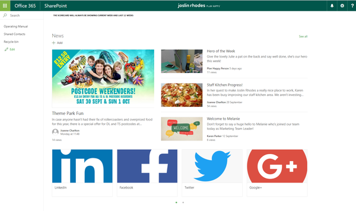

# Implementing a SharePoint Intranet

## Stats

- Completed: 14th July 2017
- Duration: 2 weeks

## Categories

- Cloud Computing & SaaS
- Programming & Development
- Software

## Creating a Company Intranet Using SharePoint Online

SharePoint usage had grown organically in the company and as a result the current site structure was complicated with duplication and many redundant sites. As part of a wider reaching project (not IT related) it was agreed the SharePoint sites should be re-designed to better fit the current business operating model. A simplified structure of eight key "hubs" was created, each hub with possible sub-hubs containing more specialised or private data.

The future design wasn't particularly complex however the need to stay flexible and future proof its implementation needed to be a key consideration. It would have been all too easy to implement the new site structure in a common tree fashion, but I could foresee this becoming too rigid in the future if sites needed to be changed. So instead of the tree structure a flat approach was used with each site created as an Office 365 Group.

By using the O365 Groups each hub, which is closely aligned with specific business departments, there would be a specific SharePoint site along with the other O365 tools for the hub/group/department if required. The flat structure was then turned into a hierarchical tree like structure through use of hyperlinks, adding common navigation links across the top of each site allowed users to quickly move around the different hubs and easily learn the Intranet's structure. If changes were then needed to the site structure, such as promoting a sub-hub, all that's needed is to update the navigation hyperlinks. No need to worry about permissions, empty parent sites, accidental deletion of sub-sites, etc.

This approach of using O365 groups and a flat site structure has worked very well, user's quickly pick up where things are located and can navigate easily, and we've been able to adjust the site structure whenever required. The groups/sites and their structure has been in use for over a year and continues to prove successful.

## Technology

- Microsoft Office 365 Business
- Microsoft SharePoint Online

<!-- origin: https://web.archive.org/web/20190819135748/https://community.spiceworks.com/people/michaelvickers/projects/implementing-a-sharepoint-intranet -->
