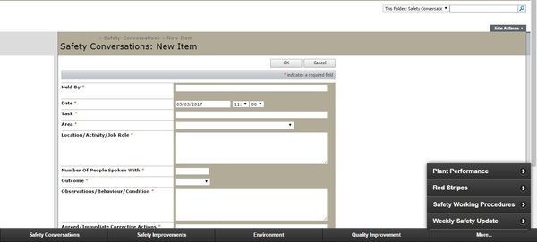

# Intranet Portal

## Stats

- Completed: 17th February 2016
- Duration: 1 month
- Users: 100

## Categories

- Programming & Development
- Software

## Simplifying Access to Internal Web Apps Using a Common Front End Tool

With a wide selection of different internal web apps in use in the business, the need for a tool to bring these all "under one roof" was becoming apparent. As well as helping to simplify access to these apps and promote their existence the tool, simply called the Portal, also gave the opportunity to break down barriers to their usage such as log-in screens and cluttered menus.

To develop the Portal jQuery Mobile was chosen as this not only gave a suitable framework, it also helped future proof the Portal ready for use on touchscreen kiosks or tablet devices. The development was straightforward and consisted of building a fixed navigation bar along the bottom of the screen to help direct users to the various web apps available. Some custom coding was needed to provide a loading icon via CSS whilst the nested web app opened, and also to perform URL processing in JavaScript as some of the web apps relied on the current date being passed via the query string.

To distribute the tool a Google Chrome app was created to display the Portal full screen, minus the usual browser menus. A specific download page was then produced so a URL could be easily shared with instructions of how to use the tool.

The Portal went on to be a great success and greatly increased the usage of the web apps, and later began to be used on dedicated touch screen kiosks.

## Technology

- CSS
- Google Chrome
- HTML5
- JavaScript
- jQuery

<!-- origin: 
https://web.archive.org/web/20221127163236/https://community.spiceworks.com/people/michaelvickers/projects/intranet-portal -->

