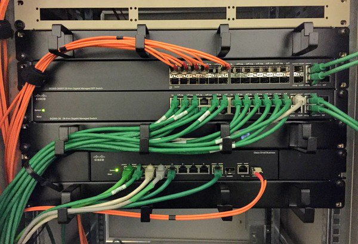

# Local Area Network Upgrade

## Stats

- Duration: 15 months
- Devices: 100
- Completed: 18th April 2016

## Categories

- Hardware
- Networking

## Replacing Network Infrastructure To Increase Bandwidth With Minimal Deployment Overhead

With a major project beginning which would replace the majority of manufacturing computing equipment, a goal had been set as part of this to upgrade the associated LAN to gigabit speed. A modest budget had been granted which therefore constrained the scale of the upgrade and the hardware which could be used. With the company standardising on Cisco devices, SG300 switches were chosen due to their balance of cost, reliability, and features. A plan was made to obviously replace existing switches, but also introduce access switches in all foreseeable locations to help future-proof the new network. As the existing network used a proprietary ring topology and protocol, to help provide fault tolerance, a new network topology would be needed along with similar safeguards.

To begin implementing the speed upgrade a bottom up approach was taken, so that new access switches could be quickly deployed followed by replacing the distribution layer later. This approach allowed the investment in the new devices and speed increase to be felt as soon as possible, and helped to minimise the outages needed.

With the access layer completed, focus then changed to the distribution switch layer and the existing ring topology was to be replaced with a tree topology. The new topology was chosen using a risk based approach which showed that although at first sight the ring topology gave reliability improvements, in actual fact there were many other points of failure which would negate this or simply render it useless. In place of the ring, link aggregation was implemented in some areas to provide increased bandwidth and redundancy benefits.

With 35 network switches to configure, deploy, and manage a method to quickly and easily configure the devices was needed. The SG300 already had a suitable method which allowed unattended configuration and firmware updates, which simply required the correct DHCP options to be given when an IP address was requested by the switch. Dnsmasq was configured to provide the necessary DHCP options by using a combination of its tagging features and the DHCP vendor classes. This resulted in a simple process to deploy a new switch: 1) configure the new device in the Dnsmasq host and config files, 2) create a new switch config file from the default template, and customise it with any specific settings needed, 3) connect the new switch to the network as which point it will automatically update its' firmware to the latest version and apply the config file.

A key benefit to the newer firmware available for the SG300 models is its Energy-Efficient Ethernet features. This has deployed extensively to give not only an environmental and cost saving benefit, but also should help reduce failures and increase product life due to reduced heat dissipation.

The new LAN infrastructure now has over 140 active hosts online and has an up time of 99.5% or greater during its first full calendar year.

## Technology

- Cables
- Cisco SG300 Layer 3 Switch
- DHCP
- Fibre optic cables
- Nagios

<!-- origin: https://web.archive.org/web/20220809224407/https://community.spiceworks.com/people/michaelvickers/projects/local-area-network-upgrade
 -->
