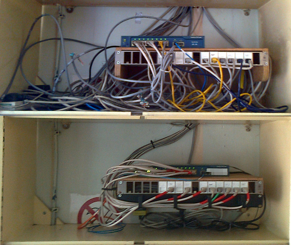
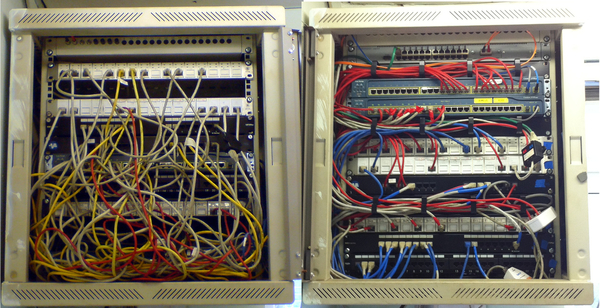
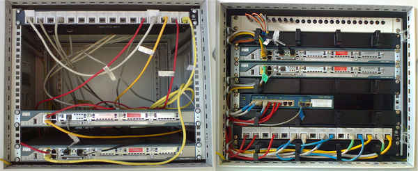
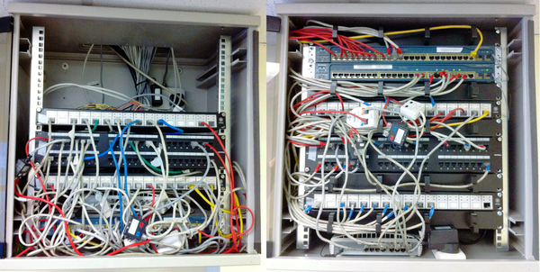

# Network Cabinet Standardisation

## Stats

- Budget: £70
- Completed: 9th September 2013
- Devices: 250
- Duration: 11 months
- Users: 250

## Categories

- Networking

## Raising the Standard of Network Cabinets With a Minimal Budget

Having inherited ownership of several local area network (LAN) cabinets through my job role, I was determined to raise their standard and in turn make management of the two physical LANs more straightforward. The cornerstone of this was to develop a standard for the cabinets, so that the layout and cable colour codes are consistent throughout all areas. The standard was not simply an idealistic view of how the cabinets should look but was designed to reduce the time and effort needed to implement it, future proof the cabinets, and work around some of the physical constraints. For example the distributed nature of the business means there is a large amount of fibre optic patch panels in the cabinets which in the majority of cases are located towards the top, therefore this was formalised as part of the standard and removed the need to unnecessarily move the patch panels.

To begin implementing the standard I prioritised the cabinets based upon their current state, when outages could be planned, and the frequency of access and/or work taking place in the cabinets. In some cases standardisation had to wait months for a planned plant maintenance period and in others it just meant staying back well after office hours once all the users had gone home. In both cases the work needed to meet the standard was methodically planned to ensure all services would be in place again following the work and so that I could carry out the work efficiently. Detailed photos were taken at each stage and a map was produced showing the patch cable connections needed. The cabinets that were in the worst states were completely emptied before being thoroughly cleaned inside and out, the equipment and cabling inspected for damage and any repairs made, a cable management system was put in place to organise the patch leads, and then cables of a suitable length and colour installed.

Having completed the work networking and patching tasks have been a pleasure. Installing new equipment is now possible with the organised layout of the cabinets, and patching made quick and easy with the cable management and colour coding. The standard also gives a professional image to the business when contractors or other staff need to work in the cabinets.

## Technology

- Cat 5 cables
- Cat 5 cabling tester
- Cisco 2800
- Cisco Catalyst 2940
- Cisco Catalyst 2960
- Cisco WS-2950-24
- Fiber optic cables
- Patch panels
- Rack management system

<!-- origin: https://web.archive.org/web/20221208090840/https://community.spiceworks.com/people/michaelvickers/projects/network-cabinet-standardisation -->
