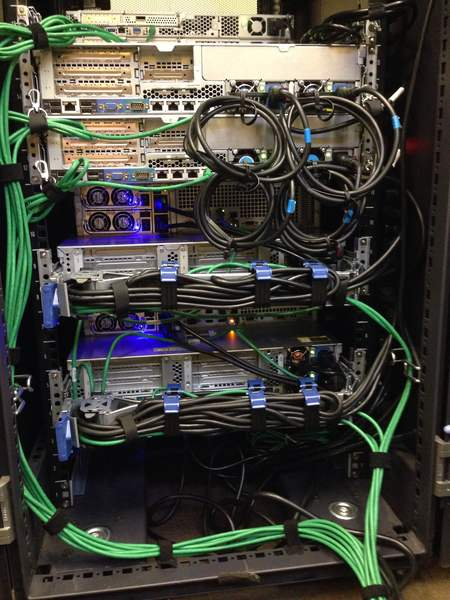
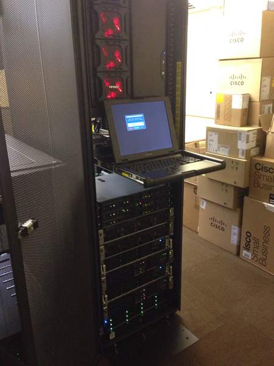
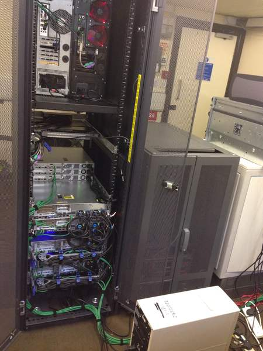
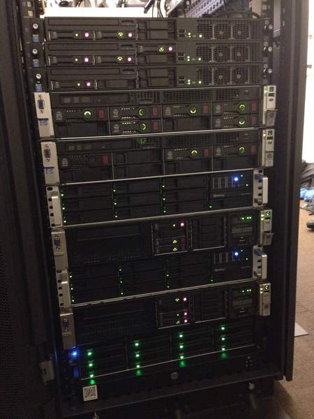

# Server Installation

## Stats

- Completed: 16th December 2015
- Duration: 2 months
- Users: 500

## Categories

- Hardware

## Installing New Servers Into an Existing Cabinet, Alongside Operational Equipment

With a major project underway to replace the majority of manufacturing computing equipment, several new servers needed to be catered for on site. The servers had initially been built and configured remotely, then brought on site for commissioning and were simply rigged up on top of an existing half-height server cabinet. The goal now was to integrate them properly into the existing cabinet meant for equipment of this purpose, with the minimal amount of outages possible.

The first stage was to design the structure of the existing cabinet and what the end goal will be; which servers could be removed due to them becoming redundant as part of the project, the best order in which to place the new and existing servers, network and power cabling requirements, and physical console access. With a design produced the next stages needed to achieve this could then be planned, such as the sequence servers could be removed, re-positioned, and installed.

To begin performing the hands on work the outages necessary where planned around the weekly business engineering maintenance periods, this meant the impact of outage would be less and there would be less users present who could be affected. It was also decided that only half of the available time would be used for these tasks, partly so that there was time to rectify any unforeseen events, but also to allow extra time so the day's task could naturally over run and any smaller less critical elements could be finished properly, e.g. cable management.

The servers were gradually introduced, sometimes it was a case of taking a step backwards to move forwards, but as the weekly outages progressed things gradually came together and the cabinet moved ever closer to the final design. Once the servers were in their final positions, the network and power cable management could be implemented, ensuring things were correctly segregated, colour coded, and designed to allow the servers to move freely in the event of any hardware servicing needed.

With the work completed it gave the server room a professional appearance once again, but equally important, made hardware tasks far quicker and more straightforward.

## Technology

- Open frame racks
- Rack cable management
- Rack mounting hardware

<!-- origin: https://web.archive.org/web/20221007161710/https://community.spiceworks.com/people/michaelvickers/projects/server-installation
 -->
