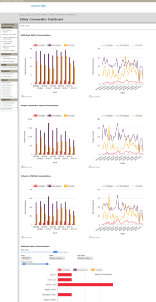

# SharePoint Data Analysis

## Stats

- Completed: 13th May 2015
- Duration: 2 months
- Users: 1,000

## Categories

- Programming & Development

## Bespoke Development To Extend SharePoint Functionality

As part of a company initiative to drive an improvement in employee Health &amp; Safety SharePoint was chosen to capture and analyse data. The choice of SharePoint was made primarily due to its Integrated Windows Authentication which would transparently login employees, thereby removing a significant barrier to the use of the system and the data which could be recorded.

The creation of the site was straightforward using the SharePoint design tools, however to provide data analysis and to increase employee engagement additional bespoke development was needed. To provide email reminders when data was expected from employees Perl scripts were created which took RSS feeds from SharePoint using cURL, processed them via FeedPP, and then sent emails to the associated employees whenever their input is expected.

For the data analysis Google Charts was used to produce a variety of visual displays in a single dashboard tool. This was accomplished by using the hidden setting for SharePoint's data tables, and then using JavaScript these were parsed and then added to Google Chart's own table structures. In several cases the standard charts could be used, however for more complex analysis the table structures where used with further hidden intermediate charts before the final chart is rendered on screen. This would empower users to manipulate the charts by allowing them to filter the data using chart controls, even though the combination and layering of controls isn't actually an out-of-the-box feature with Google Charts.

The use of SharePoint for this purpose has been a runaway success and has gone on to record over 20,000 individual submissions. The dashboard tool has been extremely popular for its simple to use interface and was shortlisted in the company's Idea of the Year award 2015.

## Technology

- Google Charts
- Perl
- Microsoft SharePoint Server 2007

<!-- origin: https://web.archive.org/web/20220929182856/https://community.spiceworks.com/people/michaelvickers/projects/sharepoint-data-analysis -->
