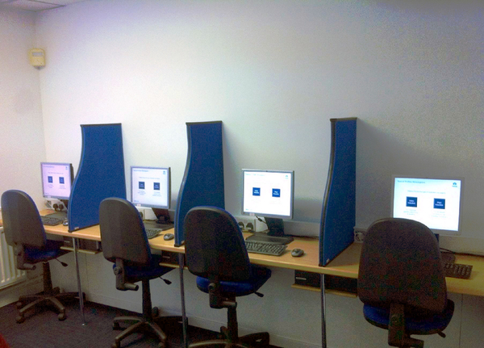

# Site Induction Facility

## Stats

- Budget: £750
- Completed: 19th March 2013
- Duration: 2 months
- Users: 500

## Categories

- Hardware
- Networking
- Software
- Windows

## Provided an Induction Facility To Deliver Effective and Consistent Business Safety Training

Having had a room set aside during office renovation works with the intention of it becoming an induction centre, I took the lead in getting the facility up and running as well as delivering the IT needed to support it. Taking the existing PowerPoint presentation used for inductions, this was customised to make it an interactive self learning tool with choices for the type of induction required, forward and back buttons, and an automatic reset once the induction was completed.

To deliver the induction 4 desktop PCs and a LAN access switch were installed in the room, with the PCs configured to automatically launch the induction package once logged in to. As the PCs were mounted out of sight underneath the desk surface a wireless keyboard and mouse combo was used with each PC to complete the minimalist environment. All the PCs are switched on automatically before the opening time using Wake-on-LAN (WOL) to help keep administration of the facility and time spent waiting for the PCs to boot up to a minimum.

Following best practice from other businesses in the group, it was agreed an induction card would be issued to each inductee showing their personal details, photo, and expiry date of their induction. An Evolis Primacy card printer was procured due to its ability to quickly print cards and handle the anticipated volume, as well as being a future proof choice coming with Ethernet and USB ports and other network and printing upgrades possible. With the printer's accessible software the template card fronts and backs could be designed in PowerPoint, which reduced the learning curve for the employees running the facility in having to learn a bespoke software package in-order to issue cards.

With the induction centre facilities in place the induction process and resources, e.g. card designs, were documented on the business's quality assurance database to ensure the procedures and files are reviewed frequently and kept up-to-date. The induction centre is now a valued part of the business's safety facilities and relied upon to deliver the site's key safety messages.

## Technology

- Cat 5 cables
- Cisco Catalyst 2940
- Evolis Primacy
- HP DC7600 small form factor PC
- IBM Lotus Notes
- Logitech K270 keyboard
- Microsoft PowerPoint 2010
- Microsoft Windows XP Pofessional
- SQL Server 7
- Wake on Lan

<!-- origin: https://web.archive.org/web/20220817015041/https://community.spiceworks.com/people/michaelvickers/projects/site-induction-facility
 -->
