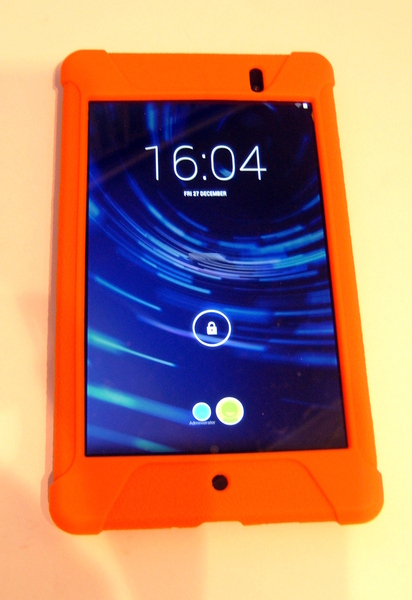

# Stock Management System

## Stats

- Budget: £4,500
- Completed: 1st April 2014
- Duration: 8 months
- Users: 100

## Categories

- Mobile computing
- Networking
- Secuirty

## Delivered a Wireless Network and Tablet Computers To Support a Stock Management Web Application

In response to a company target to make significant cost reductions a project was initiated to deliver a stock database to aid the reduction in over-aged products held in stock. The database and front end were a bespoke web application developed in-house, and I was responsible for the delivery of the networking and end user computing solutions.

To make the system as dynamic as possible the project team agreed that tablet computers would be issued to the users of the system along with a dedicated wireless local area network (WLAN). As the budget for all elements of the project was very strict, surplus wireless access points (APs) were obtained from elsewhere in the company, reset, updated with the latest firmware, and configured. With both internal and external areas requiring coverage, some of which having no electrical power let alone a wired network, a wireless mesh network was implemented to further extend the WLAN coverage.

Eventually after much wrangling between the project team and the company it was finally agreed 28 Google Nexus 7 tablets could be ordered. The tablets eventually arrived just before Christmas, after which I then had less than 5 days to configure and issue the tablets to meet the project deadline.

The configuration of the tablets was straightforward however several best practices were implemented to ensure the devices weren't abused or open to malicious behaviour. The principle of least privilege was followed and two separate user accounts created, one an "Administrator" with full privileges and the other a "User" account which had all privileges removed except for the web browser and core system functions. To ensure the security of the administrator user account, WLAN, and other accounts/apps used on the tablets high strength passwords were used throughout and where possible two factor authentication was also implemented. As the passwords were virtually impossible to memorise a system was used to securely store them securely and allow other system administrators to gain access when needed. As a final deterrent and in case of accidental loss, the Prey app was installed to provide remote tracking of each tablet.

Due to the fragmented nature of the business initial tests had identified that the tablets had the tendency to "hang on" to an AP signal when users roamed between areas, rather than automatically moving to the AP with the strongest signal. This was overcome by using the Wifi Roaming Fix (by Heleron) app which allowed the tablets to automatically switch to the best AP in range, even when the tablet was in use by an account with minimal privileges.

Each tablet also had a case to be fitted and a screen protector. After fitting 28 screen protectors I can now say I've mastered the "hinge method", and can apply them bubble free each and every time!

## Technology

- Allied Telesis media converters
- Cat 5 cables
- Fiber optic cables
- Google Android
- Google Chrome
- Google Nexus 7 2013 Tablet (Android 4.3 Jelly Bean)
- Google Search
- Hirschmann MS4128 L2P
- McAfee ePolicy Orchestrator
- Microsoft Windows XP Professional
- Nagios
- Prey
- Proxim Wireless AP 4000M
- WiFi

<!-- origin: https://web.archive.org/web/20230201025918/https://community.spiceworks.com/people/michaelvickers/projects/stock-management-system -->
