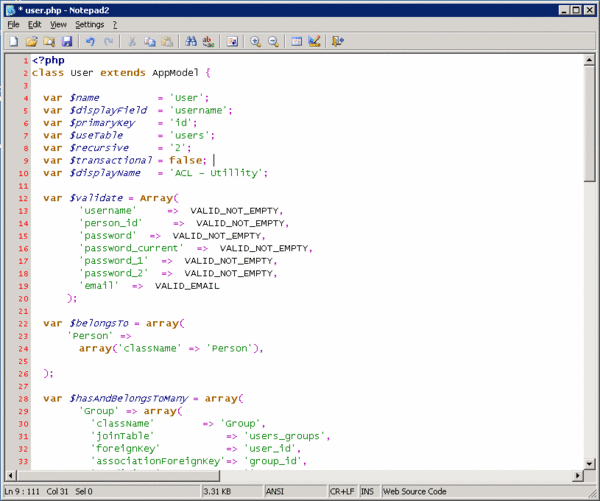
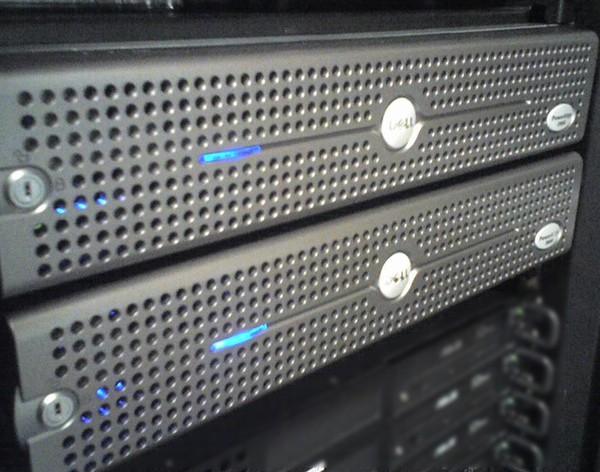

# Web Application Development

## Stats

- Completed: 15th November 2011
- Duration: 6 months
- Users: 1000+

## Categories

- Databases
- Hardware
- Programming & Development
- Software
- Windows

## Bespoke Web Application Development and Intranet Web Server Build

With the need to develop larger and more complex web applications, and having outgrown the existing PC which was now the business wide intranet web server I undertook the development of a new Intranet server. The development of the server also allowed me to restructure the services for the business in more organised fashion, centralising key systems on one well managed and more modern server. As there was minimal budget for this task a surplus Dell PowerEdge 2850 was refreshed with some new hard discs and appropriate RAID levels configured, and then Windows 2003 Server installed upon it. To run the web apps IIS, PHP, and MS SQL Server were set up and a Subversion repository created to manage the code.

To simplify the development of the new web apps a model–view–controller (MVC) architecture was chosen along with a framework application to speed up development. After some considerable research CakePHP was chosen along with other supporting software such as JpGraph to allow dynamic charts to be created. The web app's main purpose was to record, edit, and report Health &amp; Safety information but also required development of features such as personnel management, user authentication and permissions, and automated reporting and alerts.

The web apps created have gone on to become best practice throughout the company, and are now used at several other businesses across the UK and Europe. The server as well has proven successful and very reliable, with availability of 99.56% in its first year of operation.

## Technology

- Apache Subversion
- CakePHP
- IIS
- JpGraph
- Microsoft Windows Server 2003
- PHP
- SQL Server 7

<!-- origin: https://web.archive.org/web/20220817021051/https://community.spiceworks.com/people/michaelvickers/projects/web-application-development -->
