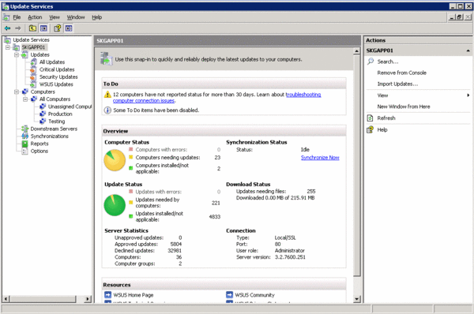

# Windows Update Distribution

## Stats

- Completed: 15th October 2011
- Duration: 6 weeks

## Categories

- Security
- Software
- Windows

## Ensuring Windows Computers Are Updated With the Latest Patches and Hotfixes With Minimal Administration

With a primarily Windows computer landscape within the business and the fragment nature of the business, providing updates and ensuring they are installed successfully on every computer was both difficult and time consuming. After some research the Windows Server Update Services (WSUS) program was identified as a way to simplify the updating process, and with some bespoke configuration, eliminate the administration overheads associated with using it.

WSUS servers already existed within the company however to reduce the bandwidth consumption and provide local management WSUS was installed on a suitable server located at the business, and then configured to synchronise with a central WSUS server. Best practices for WSUS were then followed to re-index and defragment the WSUS databases automatically, and provide email alerts for update synchronisation and computer statuses.

With a local WSUS server now available computers could be migrated to use it for their updates. The Windows computers were first prioritised and those which could be used for testing of both the process and new updates identified. Starting with the test computers an internal company program was used to set the WSUS server to be used and when the updates should be installed. In the majority of cases the updates were to be applied automatically thus removing the need to manually allow installation. On the server side two groups of computers were created "Testing" and "Production", with the Testing group having automatic approvals and the Production group getting all updates approved manually once the Testing group had validated no conflicts or errors occurred when the updates were installed.

The same WSUS configuration was then implemented as best practice at a second business to provide the same benefits and minimise the administration needed.

## Technology

- Batch file
- Microsoft Background Intelligent Transfer Service (BITS)
- Microsoft SQL Server 2005
- Microsoft Windows 2000 Pro
- Microsoft Windows 7 Ultimate
- Microsoft Windows Server 2003
- Microsoft Windows Server Update Services
- Microsoft Windows XP Professional

<!-- origin: https://web.archive.org/web/20220929182656/https://community.spiceworks.com/people/michaelvickers/projects/windows-update-distribution -->
